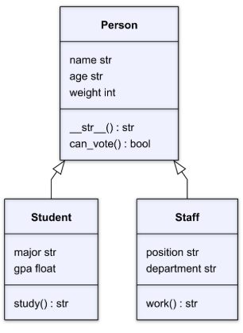

# COMPS III: Assignment #2 - `Person`, `Staff`, and `Student` Classes

## Instructions
**TASK**: In this assignment, you will expand on your understanding of Python classes, objects, methods, and attributes to further explore inheritance. You will create a parent `Person` class similar to last week and then two additional child classes (`Student` and `Staff`) that inherit attributes and methods from the parent class.



Your `Person` class should have the following attributes and methods:
- **Attributes**
    - `name (string)`: A string that contains the individual’s name.
    - `age (integer)`:  An integer containing the individual’s age.
    - `country (string)`: A string containing the individual’s country.
- **Methods**
    - `__str__()`: This method should return a string with the object's information in the format: “NAME is AGE years old and is from COUNTRY.”

Your `Student` class should inherit all of the attributes and methods of the `Person` class. The `Student` class should have the following additional attributes and methods:
- **Attributes**
    - `major (string)`: A string that contains the individual’s major.
    - `gpa (float)`:  A float containing the individual’s grade point average.
- **Methods**
    - `study()`: This method should return a string in the format: “[name] is studying [major] with a current GPA of [gpa].”

Finally, your `Staff` class should inherit all of the attributes and methods of the `Person` class. The `Staff` class should have the following additional attributes and methods:
- **Attributes**
    - `position (string)`: A string that contains the individual’s current position.
    - `department (string)`:  A string containing the individual’s department.
- **Methods**
    - `work()`: This method should return a string in the format: “[name] works as a [position] in the [department] department.”

## Grading Your Work
This assignment can grade itself! To setup the autograding, you should do the following:
1. Clone this file to your local machine using the command
```bash
git clone PASTE_URL_HERE
```
2. Open the downloaded file in your VS Code editor.
3. In the left hand sidebar, press the "Testing" menu represented by the picture of a flask.
4. Click "Configure Python Tests".
5. You'll have two options to select. Select **pytest**.
6. Select the folder where the tests live. You can simply select `. Root directory`.
7. You can now run the tests by pressing the play icon. A passing test will get a ✅ and a failing test will get a ❌.
8. Run the tests as you code and by the end it should be all ✅ if you have followed the specifications for this assignment!

## Unit Tests
- `Person`
    - **Name**: "Billy"
    - **Age**: 17 
    - **Country**: "Canada"
- `Student`
    - **Name**: "John"
    - **Age**: 17
    - **Country**: "Canada"
    - **Major**: "Computer Science" 
    - **GPA**: 3.5
- `Staff`
    - **Name**: "Jane"
    - **Age**: 30
    - **Country**: "USA"
    - **Position**: "Professor"
    - **Department**: "Computer Science"

### Unit Test Explanations
- `test_can_create_person`: Tests that a `Person` object can be created with the values provided above.
- `test_person_string`: Tests that the `Person` object from the previous test produces the following `__str__` method output `Billy is 17 years old and is from Canada."`
- `test_student_inheritance`: Tests that a `Student` object can be created and that it inherits properties/methods from the `Person` class.
- `test_student_attributes`: Tests that the `Student` provided above has set each attribute correctly.
- `test_student_study`: Tests that the `study()` method for the created `Student` object returns the string `"John is studying Computer Science with a current GPA of 3.5."`
- `test_staff_inheritance`: Tests that a `Staff` object can be created and that it inherits properties/methods from the `Person` class.
- `test_staff_attributes`: Tests that the `Staff` provided above has set each attribute correctly.
- `test_staff_work`: Tests that the `work()` method for the created `Staff` object returns the string `"Jane works as a Professor in the Computer Science department."`